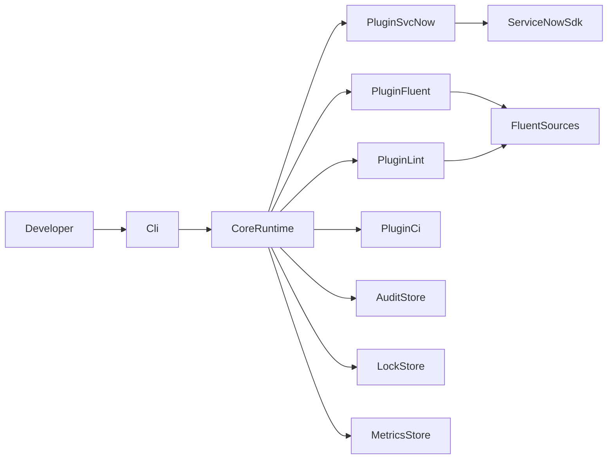

# Architecture

Sincronia is a plugin-driven orchestration layer around ServiceNow SDK + Fluent.

## Runtime Guarantees

- Structured typed errors with resolution hints
- Plugin hook isolation with optional fail-fast behavior
- Retry/backoff for critical remote SDK operations
- Local lock-based protection for deploy/sync collisions
- Audit events for command outcomes

## Metadata and logic split

- `fluent/**`: metadata-as-code
- `src/**`: TypeScript logic, Script Includes, utility modules

## Scalability model

- Monorepo workspaces + Turbo task graph
- Environment and instance segmentation via `.sincronia.config.*`
- CI gates and promotion stages (`dev` -> `qa` -> `stage` -> `prod`)
