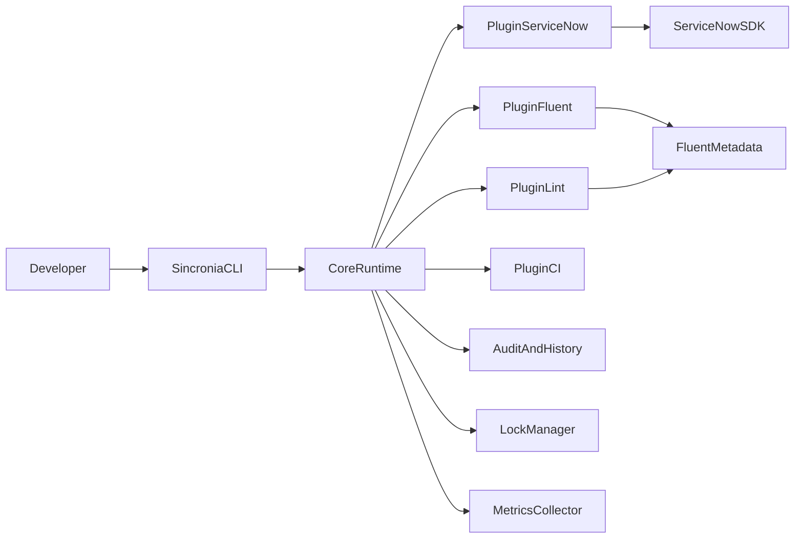
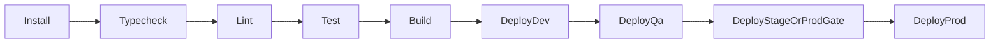

# Sincronia Technical Documentation

## 1. Project Overview

Sincronia is a TypeScript-first ServiceNow development platform that combines:

- Fluent DSL for metadata-as-code
- ServiceNow SDK for build/deploy execution
- Plugin lifecycle orchestration for extensibility
- Enterprise operational controls for reliability and safe deployments

It is designed for multi-team, multi-instance delivery in large organizations.

## 2. Architecture

### 2.1 High-Level Flow



### 2.2 Runtime Lifecycle

Sincronia executes command phases through a plugin lifecycle:

- `before:init` / `after:init`
- `before:build` / `after:build`
- `before:deploy` / `after:deploy`
- `before:sync` / `after:sync`
- `before:test` / `after:test`
- `before:lint` / `after:lint`
- `before:dev` / `after:dev`
- `before:generate` / `after:generate`

Each hook runs with typed context (`runId`, logger, flags, metrics, config).

## 3. Technology Stack

| Area                   | Technology                                     |
| ---------------------- | ---------------------------------------------- |
| Language               | TypeScript                                     |
| Runtime                | Node.js 18+                                    |
| Build Orchestration    | Turborepo                                      |
| CLI                    | Commander                                      |
| Validation             | Zod                                            |
| Test Framework         | Vitest                                         |
| File Watcher           | Chokidar                                       |
| ServiceNow Integration | `@servicenow/sdk` (dual-mode command strategy) |
| CI/CD                  | GitHub Actions, Azure DevOps                   |

## 4. Setup and Installation

### 4.1 Install

```bash
npm ci
```

### 4.2 Verify

```bash
npm run ci
```

### 4.3 Initialize

```bash
npx sincronia init
```

## 5. Configuration

Configuration is loaded from one of:

- `.sincronia.config.ts`
- `.sincronia.config.mts`
- `.sincronia.config.js`
- `.sincronia.config.mjs`
- `.sincronia.config.cjs`

### 5.1 Example

```ts
export default {
  defaultEnvironment: "dev",
  sdkCommand: ["npx", "@servicenow/sdk"],
  appRoot: "apps/example-fluent-app",
  environments: {
    dev: {
      instances: [
        {
          name: "dev-primary",
          instanceUrl: "https://dev00000.service-now.com",
          authProfile: "dev",
        },
      ],
      policy: {
        protected: false,
        requireConfirmation: false,
        allowedBranches: ["*"],
      },
    },
    qa: {
      instances: [
        {
          name: "qa-primary",
          instanceUrl: "https://qa00000.service-now.com",
          authProfile: "qa",
        },
      ],
      policy: {
        protected: false,
        requireConfirmation: true,
        allowedBranches: ["main", "release/*"],
      },
    },
    stage: {
      instances: [
        {
          name: "stage-primary",
          instanceUrl: "https://stage00000.service-now.com",
          authProfile: "stage",
        },
      ],
      policy: {
        protected: true,
        requireConfirmation: true,
        allowedBranches: ["main", "release/*"],
      },
    },
    prod: {
      instances: [
        {
          name: "prod-primary",
          instanceUrl: "https://prod00000.service-now.com",
          authProfile: "prod",
        },
      ],
      policy: {
        protected: true,
        requireConfirmation: true,
        allowedBranches: ["main"],
      },
    },
  },
};
```

### 5.2 Policy Controls

| Field                 | Purpose                              |
| --------------------- | ------------------------------------ |
| `protected`           | Marks environment as sensitive       |
| `requireConfirmation` | Enforces interactive confirmation    |
| `allowedBranches`     | Restricts deployment source branches |

## 6. Development Workflow

### 6.1 Standard Loop

1. Author Fluent metadata in `fluent/**`
2. Author TypeScript logic in `src/**`
3. Run `sincronia build --env dev`
4. Run `sincronia deploy --env dev`

### 6.2 Watch Loop

```bash
npx sincronia dev --watch --env dev
```

Behavior:

- Debounced file-change handling
- Serialized build/deploy queue
- Cache-based skip for unchanged Fluent metadata
- Graceful watcher shutdown on process signals

## 7. CI/CD Pipeline

## 7.1 GitHub Actions

- `ci.yml`: typecheck, lint, test, build
- `deploy.yml`: manual `workflow_dispatch` deployment by environment
- Concurrency and minimal permissions enabled

## 7.2 Azure DevOps

- Validate stage plus promotion path:
  - `DeployDev`
  - `DeployQa`
  - `DeployProd`

### 7.3 Pipeline Stages



## 8. Testing Strategy

### 8.1 Unit Tests

- Core reliability modules:
  - retry behavior
  - lock semantics
  - plugin isolation

### 8.2 Integration Tests

- CLI config loading and validation
- Plugin-specific behavior (e.g. lint validation)

### 8.3 E2E Workflow Simulation

CI pipeline validates end-to-end workflow simulation:

1. Build metadata + logic
2. Execute command lifecycle
3. Run test suite

## 9. Security and Compliance

### 9.1 Credentials

- No plain-text credentials committed
- Use environment-scoped secrets and SDK auth profiles

### 9.2 Safe Deployments

- Dry-run support for deployment previews
- Protected environment confirmation prompts
- Branch policy enforcement

### 9.3 Auditability

- Command outcomes persisted in audit logs
- Deployment history records in `.sincronia/history`

## 10. Plugin System

Plugins are versioned npm packages that hook into lifecycle events.

Built-in plugins:

| Plugin                         | Responsibility                          |
| ------------------------------ | --------------------------------------- |
| `@sincronia/plugin-servicenow` | SDK execution, retry, deploy resilience |
| `@sincronia/plugin-fluent`     | Fluent discovery, cache fingerprinting  |
| `@sincronia/plugin-lint`       | Naming and static validation            |
| `@sincronia/plugin-ci`         | CI scaffold generation                  |

Isolation model:

- Hook failures are wrapped into typed `PluginError`
- Non-fail-fast behavior available via `--trace`

## 11. Deployment and Environment Management

### 11.1 Multi-Instance Environments

Each environment may define multiple instances through `instances[]`.

### 11.2 Operational Controls

- Locks prevent concurrent deploy/sync collisions
- Retry/backoff handles transient network/SDK failures
- Best-effort rollback path is triggered on deploy failure

### 11.3 Recommended Promotion

`dev` -> `qa` -> `stage` -> `prod`

Use approvals and environment protections in CI/CD platform settings.

## 12. FAQ

### Q: What happens if the SDK command fails transiently?

Critical operations use retry with exponential backoff before surfacing failure.

### Q: Can I prevent accidental production deployments?

Yes. Configure `protected`, `requireConfirmation`, and `allowedBranches`.

### Q: How do I debug command failures?

Run with:

```bash
npx sincronia <command> --trace --verbose
```

### Q: Does Sincronia support large monorepos?

Yes. It is workspace-based and uses Turbo for incremental task execution and caching.
